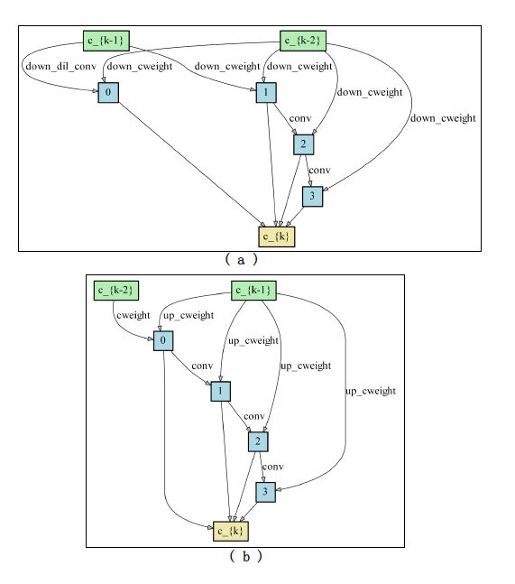

## NAS-Unet: Neural Architecture Search for Medical Image Segmentation

In this paper, we design three types of primitive operation set on search space to automatically find two
cell architecture DownSC and UpSC for semantic image segmentation especially medical image segmen-
tation. The architectures of DownSC and UpSC updated simultaneously by a differential
architecture strategy during search stage. We demonstrate the well segmentation results of the proposed
method on Promise12, Chaos and ultrasound nerve datasets, which collected by Magnetic Resonance
Imaging (MRI), Computed Tomography (CT), and ultrasound respectively.


## Requirement

+ Ubuntu14.04/16.04 or Window10 (Win7 may also support.)
+ python 3.7
+ torch >= 1.0
+ torchvision >= 0.2.1
+ tqdm
+ numpy
+ pydicom (for chao dataset)
+ SimpleITK (for promise12 dataset)
+ Pillow
+ scipy
+ scikit-image
+ adabound
+ PyYAML
+ opencv-python
+ tensorboardX
+ matplotlib (optional)
+ pydensecrf (optional)
+ pygraphviz (optional)
+ graphviz (optional)


TODO:

- [ ] Parallel compute no-topology related operation in DownSC and UpSC
- [ ] Optimize multi objective by adding hardware metrics (delay), GPU cost and network parameters
- [x] Support multi gpus when update the architecture parameters (2019/04/28)
- [ ] Extend search strategy for a flexible backbone network
- [ ] Merge this work to CNASV ( Search-Train Prototype for Computer Vision [CNASV](https://github.com/tianbaochou/CNASV))


## Usage

```bash
pip3 install -r requirements.txt
```

**Noticing**
> 
+ **1.** Display Cell Architecture 
    + If you use win10, and want to show the cell architecture with graph, you 
need install the pygraphviz and add ```$workdir$\\3rd_tools\\graphviz-2.38\\bin```
into environment path. Here ```$workdir$``` is the custom work directory. such as ```E:\\workspace\\NasUnet``` 
    + If you use ubuntu, install graphviz by : `sudo apt-get install graphviz libgraphviz-dev pkg-config`
    
After that install `pygraphviz` : `pip install pygraphviz`


+ **2.** If you use win10, and you also need to add the bin path of ```nvidia-smi``` to you environment path.
Because we will automatically choose the gpu device with max free gpu memory to run!.

+ **3.** If you want to use multi-gpus during training phase.
you need make sure the batch size can divide into gpus evenly.
which (may be pytorch bug!). For example, if you have 3 gpus, and the 
batch size need to be ```3, 6, 9 ... 3xM```.

+ **4.** When you meet CUDA OOM problems, the following tricks will help you:
    + A. set lower ```init_channels``` in configure file, such as ```16, 32, or 48```.
    + B. set lower ```batch_size``` such as ```2, 4, 6, 8```.
    + C. when you use a large image size, such as 480, 512, 720 et. al. the initial channels and batch size 
         may be much smaller.


### Search the architecture

```bash
cd experiment
# search on pascal voc2012
python train.py --config ../configs/nas_unet/nas_unet_voc.yml
```

### Evaluate the architecture on medical image datasets

+ train on promise12 dataset use nasunet
```bash
python train.py --config ../configs/nas_unet/nas_unet_promise12.yml --model nasunet
```

+ if you want to fine tune model:

```bash
python train.py --config ../configs/nas_unet/nas_unet_promise12.yml --model nasunet --ft
```

+ use multi-gpus

**edit configs/nas_unet/nas_unet_promise12.yml**

```yaml
training:
    geno_type: NASUNET
    init_channels: 32
    depth: 5
    epoch: 200
    batch_size: 6
    report_freq: 10
    n_workers: 2
    multi_gpus: True # need set to True for multi gpus
```

and then 

```bash
python train.py --config ../configs/nasunet/nas_unet_promise12.yml --model nasunet --ft
```

We will use the all gpu devices for training.

>Both in search and train stage, if you run in one gpu, we will find a max free gpu and transfer model to it.
So you can run N instances without manual set the device ids, if you have N gpu devices.

The final architectures of DownSC and UpSC we searched on pascal voc 2012.




### Custom your dataset

+ Firstly, normalize the custom dataset. you need `mean` and `std` see `util/dataset/calc_mean_std`

+ Secondly, add `CustomDataset` in `util/dataset/CustomDataset.py`

+ Finally, edit `util/dataset/__init__.py`, add your CutomDataset dataset and replace the 
`dir = '/train_tiny_data/imgseg/'` to `dir = '/your custom dataset root path/'`

## Citation

If you use this code in your research, please cite our paper.
```
@ARTICLE{8681706, 
author={Y. {Weng} and T. {Zhou} and Y. {Li} and X. {Qiu}}, 
journal={IEEE Access}, 
title={NAS-Unet: Neural Architecture Search for Medical Image Segmentation}, 
year={2019}, 
volume={7}, 
number={}, 
pages={44247-44257}, 
keywords={Computer architecture;Image segmentation;Magnetic resonance imaging;Medical diagnostic imaging;Task analysis;Microprocessors;Medical image segmentation;convolutional neural architecture search;deep learning}, 
doi={10.1109/ACCESS.2019.2908991}, 
ISSN={2169-3536}, 
month={},}
```


